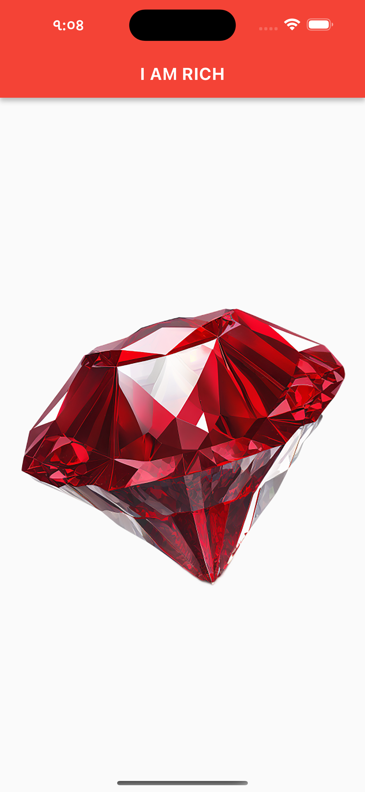
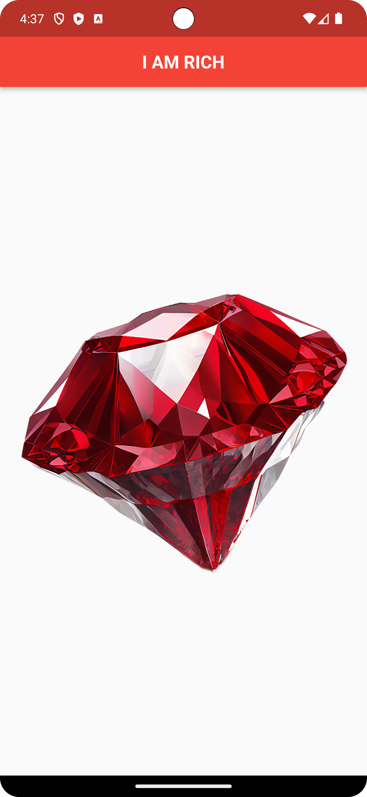

## Hello ! My Gorgeous and Lovely Friend 

I'm Abdul Halim Reiaz, You can Call me MrReiaz, a Full Stack Web and Mobile Application Developer from . Now Live in Japan  and Content Creator on [Youtube](https://www.youtube.com/c/MrReiaz?sub_confirmation=1) and [Facebook](https://www.facebook.com/mrreiaz23). I Spend most of time read different types of books and learn different types of coding and programing concepts and recording YouTube Videos.

:coffee:  Connect with me!

      

:hearts: &emsp;I love programming and sharing knowledge  
:computer: &emsp;Most used line of code `Hello World!`  
🤔 &emsp;I’m looking for people who can help me to think something Outstanding  and executions. 
:e-mail: &emsp;How to reach me: reiazbubt@gmail.com. 
⚡ &emsp;Fun fact: I am a co-founder of one of largest digital marketing agency in  Bangladesh named StoryIT.

#### Contacts with me 

:email: &emsp;reiazbubt@gmail.com
 
:email: &emsp;infreiaz@gmail.com

#### Visits My Website
www.mrreiaz.com

# I Am rich App
I Am Rich is a 2008 mobile app for iPhones which had minimal function and was priced at US$999.99 (equivalent to $1,359 in 2022). The app was pulled from the App Store less than 24 hours after its launch. Receiving poor reviews from critics, only eight copies were sold. In the years since, several similar applications have been released at lower prices.
 

 
## As a beginner Flutter developer I recreate that apps.
 

    <figure>
        
      <figcaption>Fig.1 - Iphone App</figcaption>
    </figure>
    

    <figure>
        
      <figcaption>Fig.2 Android App.</figcaption>
    </figure>

